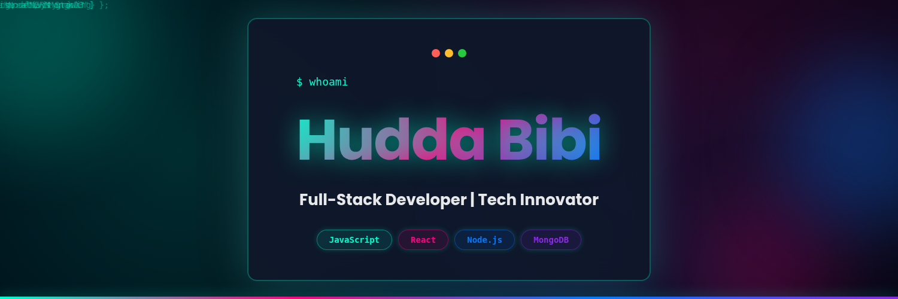
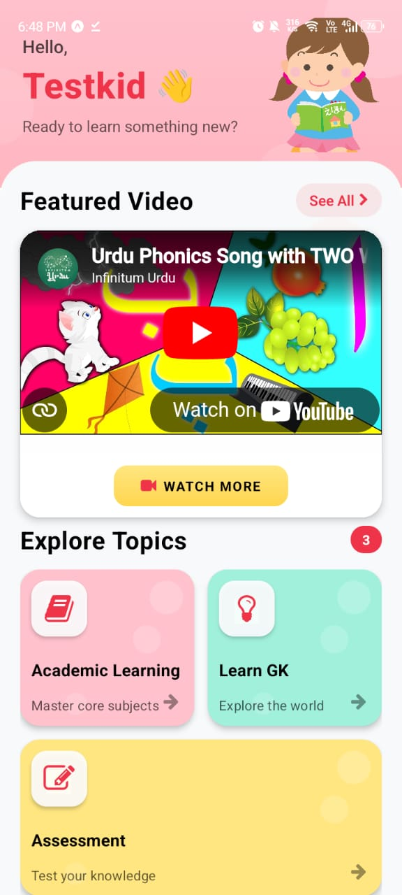

<!--Banner-->

# Hi, I'm Hudda Bibi! 👋  
**Passionate Developer | Web Technologies Enthusiast | Open Source Contributor**

---

## 👨‍💻 About Me

Welcome to my GitHub! I'm a passionate developer dedicated to turning innovative ideas into real-world applications. I constantly strive to improve my technical skills and create meaningful solutions through code.

### 🌟 What I'm Excited About:
- Building modern, responsive web applications with **MERN Stack**
- Creating seamless user experiences with **React.js** and **Next.js**
- Developing robust backend systems with **Node.js** and **Express.js**
- Contributing to open-source projects and collaborating with the developer community

### 🚀 Current Focus:
- Mastering the **MERN Stack** (MongoDB, Express.js, React.js, Node.js)
- Exploring **API development** and integration
- Enhancing **UI/UX design** skills
- Building scalable and performant applications

---

## 🛠️ Technical Skills

### Languages

### Frontend & Backend

### Databases & Tools

---

## 📂 My Repositories

### 🌟 Featured Projects

<table>
<tr>
<td width="50%">
<h3 align="center">PrepPal Admin Portal</h3>

 
 

<strong>Admin Dashboard, Web Development</strong>

Admin Dashboard for PrepPal pre-school learning platform. Manages academic content, learning categories, quizzes, and user data with role-based access control.

</td>

<td width="50%">
<h3 align="center">PrepPal Mobile App</h3>

 
 

<strong>Mobile Development, Educational App</strong>

Pre-school learning mobile app for kids aged 3-5 featuring interactive modules for alphabets, numbers, colors, shapes, with quizzes and progress tracking.

</td>
</tr>

<tr>
<td width="50%">
<h3 align="center">Property Selling Website</h3>

<strong>HTML, CSS, Responsive Design</strong>

Static property-selling website showcasing frontend fundamentals, responsive design, and visual presentation for real estate listings.

</td>

<td width="50%">
<h3 align="center">Flappy Bird Re-Engineering</h3>

<strong>Software Re-Engineering, Code Refactoring</strong>

Forked Flappy Bird project focusing on refactoring, removing code smells, and improving software design and maintainability.

</td>
</tr>
</table>

---

## 🎥 Project Demo

### 🌐 PrepPal Admin Portal Demo

https://user-images.githubusercontent.com/your-user-id/Web.mp4

> **Video embed instructions:**
> 1. Go to GitHub and edit this README.md
> 2. Position cursor below this heading
> 3. Drag and drop `Web.mp4` from your computer
> 4. GitHub will auto-generate the correct video embed URL
> 5. Delete these instructions after adding the video

**[Click here to download the demo video](https://github.com/s1hb888/s1hb888/raw/main/Web.mp4)**

*Content management dashboard for the PrepPal educational platform*

---

## 🎓 Project Highlights

### PrepPal Ecosystem (Final Year Project)
A comprehensive pre-school learning platform consisting of:
- **Mobile Application**: Interactive learning for kids aged 3-5
- **Admin Dashboard**: Content management and progress monitoring
- **Features**: Quizzes, audio learning, parent controls, progress tracking
- **Technologies**: Mobile development, Web dashboard, Database management

### Software Engineering Practices
- **Code Refactoring**: Improving existing codebases and removing code smells
- **Design Patterns**: Implementing software design principles and architectural patterns
- **Web Development**: Building responsive and user-friendly interfaces

---

## 📊 GitHub Stats

  
  

---

## 💡 Design Philosophy

  <i>"I believe in writing clean, maintainable code that not only works but is also elegant and efficient. 
  Every project is an opportunity to learn something new and push the boundaries of what's possible."</i>

---

## 🤝 Connect With Me

  
  
  
  
  
  
  
  

 

  <i>💼 Open to freelance opportunities and collaborations</i> 
  <i>🎓 Passionate about educational technology and web development</i> 
  <i>🚀 Let's build something amazing together!</i>

---

  

  Made with ❤️ by Hudda Bibi

